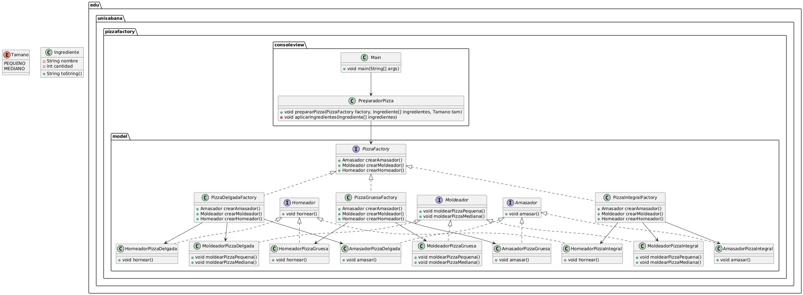

# Universidad de la Sabana
*Diseño y Arquitectura de Software*
---

# Sistema de Fabricación de Pizzas Automatizado

Este proyecto implementa un sistema de fabricación de pizzas automatizado utilizando el **Patrón de Fábrica Abstracta**. El sistema permite preparar pizzas de diferentes tipos (delgada, gruesa e integral) y tamaños (pequeño y mediano) de manera flexible y extensible.

## Requisitos del Proyecto

El sistema debe:
1. Permitir la preparación de pizzas de masa delgada, gruesa e integral.
2. Soportar tamaños de pizza pequeños y medianos.
3. Seguir una secuencia de pasos común para todas las pizzas: amasar, moldear, aplicar ingredientes y hornear.
4. Ser fácil de extender para agregar nuevos tipos de pizza sin modificar el código existente.

## Implementación

### Patrón de Fábrica Abstracta

Se utilizó el **Patrón de Fábrica Abstracta** para desacoplar la lógica de preparación de pizzas de los detalles específicos de cada tipo de masa. Esto permite agregar nuevos tipos de pizza sin modificar el código principal.

#### Estructura del Proyecto

- **Interfaces**:
    - `Amasador`: Define el método `amasar()`.
    - `Moldeador`: Define los métodos `moldearPizzaPequena()` y `moldearPizzaMediana()`.
    - `Horneador`: Define el método `hornear()`.
    - `PizzaFactory`: Define los métodos para crear un `Amasador`, un `Moldeador` y un `Horneador`.

- **Fábricas Concretas**:
    - `PizzaDelgadaFactory`: Crea instancias de `AmasadorPizzaDelgada`, `MoldeadorPizzaDelgada` y `HorneadorPizzaDelgada`.
    - `PizzaGruesaFactory`: Crea instancias de `AmasadorPizzaGruesa`, `MoldeadorPizzaGruesa` y `HorneadorPizzaGruesa`.
    - `PizzaIntegralFactory`: Crea instancias de `AmasadorPizzaIntegral`, `MoldeadorPizzaIntegral` y `HorneadorPizzaIntegral`.

- **Implementaciones Concretas**:
    - `AmasadorPizzaDelgada`, `MoldeadorPizzaDelgada`, `HorneadorPizzaDelgada`.
    - `AmasadorPizzaGruesa`, `MoldeadorPizzaGruesa`, `HorneadorPizzaGruesa`.
    - `AmasadorPizzaIntegral`, `MoldeadorPizzaIntegral`, `HorneadorPizzaIntegral`.

### Menú Interactivo

Se implementó un menú interactivo que permite al usuario seleccionar el tipo de pizza y el tamaño. El programa utiliza la fábrica correspondiente para preparar la pizza seleccionada.

#### Ejemplo de Uso

1. El usuario selecciona el tipo de pizza (delgada, gruesa o integral).
2. El usuario selecciona el tamaño de la pizza (pequeño o mediano).
3. El sistema prepara la pizza siguiendo la secuencia de pasos: amasar, moldear, aplicar ingredientes y hornear.

### Ejecución del Programa

```bash
Seleccione el tipo de pizza:
1. Pizza Delgada
2. Pizza Gruesa
3. Pizza Integral
4. Salir
Ingrese su opción: 1
Seleccione el tamaño de la pizza (1: Pequeño, 2: Mediano):
2
[@@] Amasando la pizza delgada con masa convencional.
[O] Moldeando pizza mediana de masa convencional.
APLICANDO INGREDIENTES!: [(queso,1), (jamon,2)]
[~~] Horneando la pizza delgada con masa convencional.
```
## Diagrama UML

A continuación se muestra el diagrama UML del sistema:



---

## Cómo Ejecutar el Proyecto

1. Clona el repositorio.
2. Abre el proyecto en tu IDE favorito.
3. Ejecuta la clase `PreparadorPizza` para iniciar el menú interactivo.

---

## Extensibilidad

El sistema está diseñado para ser fácilmente extensible. Para agregar un nuevo tipo de pizza:

1. Crea una nueva fábrica que implemente `PizzaFactory`.
2. Crea las implementaciones concretas para `Amasador`, `Moldeador` y `Horneador`.
3. Agrega la nueva opción al menú interactivo.

---


**Andrés Azcona**  
*Estudiante de Ingenieria Informatica*  
Universidad de La Sabana